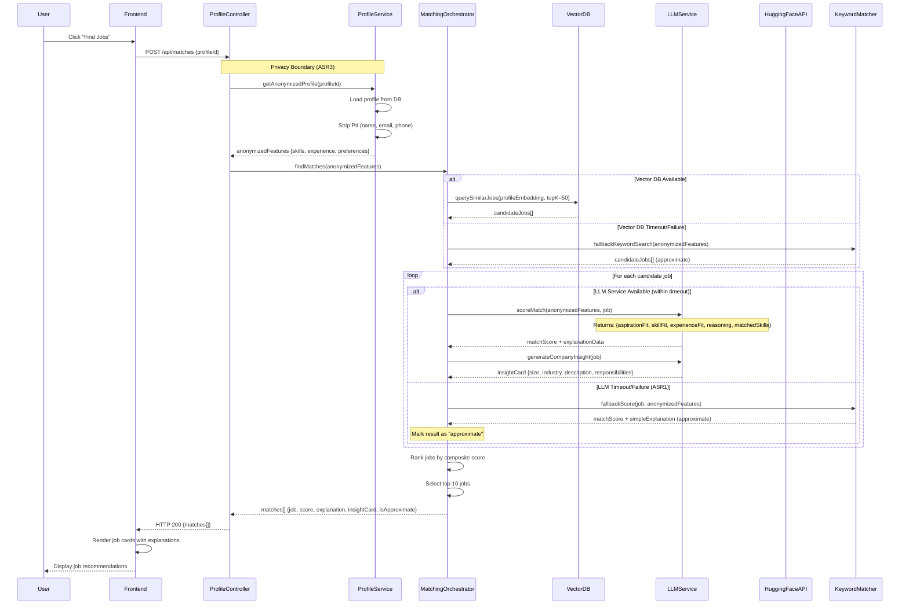

# Matcha Design Artifacts

## Table of Contents
1. [UML Sequence Diagram: Job Matching Flow](#uml-sequence-diagram)
2. [UML Activity Diagram: Profile Capture with Speech-to-Text](#uml-activity-diagram)
3. [Design Patterns](#design-patterns)

---

## UML Sequence Diagram: Job Matching Flow

This sequence diagram illustrates the end-to-end flow of job matching, including AI service integration, fallback mechanisms, and privacy boundary enforcement (ASR1, ASR2, ASR3).



**Key Interactions:**
- **Privacy Boundary**: ProfileService strips PII before passing data to MatchingOrchestrator
- **Fault Tolerance**: Multiple fallback paths (VectorDB → KeywordMatcher, LLM → KeywordMatcher)
- **Explainable Output**: LLM returns structured explanation data (ASR2), not just scores
- **Timeout Handling**: All external calls have timeout protection (ASR1)

---

## UML Activity Diagram: Profile Capture with Speech-to-Text

This activity diagram shows the multi-step profile capture process, including speech-to-text integration, transcript editing, and data persistence (FR1, NFR2, ASR3).

```mermaid
flowchart TD
    Start([User Starts Profile Creation]) --> Step1[Step 1: Basic Info]
    Step1 --> Step2[Step 2: Skills & Tech Stack]
    
    Step2 --> InputChoice{Input Method?}
    InputChoice -->|Voice| RecordAudio[Record Audio via Microphone]
    InputChoice -->|Text| TextInput[Enter Text Directly]
    
    RecordAudio --> SendAudio[POST /api/transcribe<br/>Send audio blob to backend]
    SendAudio --> HFWhisper[Backend: Call Hugging Face<br/>Whisper API]
    HFWhisper --> TranscriptReceived[Receive Transcript]
    TranscriptReceived --> DisplayTranscript[Display Transcript<br/>with Edit Option]
    
    TextInput --> DisplayTranscript
    DisplayTranscript --> UserReview{User Reviews<br/>& Edits?}
    UserReview -->|Edit| DisplayTranscript
    UserReview -->|Confirm| HighlightFields[Highlight Critical Fields<br/>skills, degree, years]
    
    HighlightFields --> VerifyCritical{Verify Critical<br/>Fields?}
    VerifyCritical -->|No| DisplayTranscript
    VerifyCritical -->|Yes| Step3[Step 3: Experience Summary]
    
    Step3 --> Step4[Step 4: Job Preferences]
    Step4 --> Step5[Step 5: Review & Consent]
    
    Step5 --> ShowPrivacyNotice[Display Privacy Notice<br/>Third-party AI usage]
    ShowPrivacyNotice --> UserConsent{User Consents?}
    UserConsent -->|No| Step1
    UserConsent -->|Yes| SubmitProfile[POST /api/profiles<br/>Submit Profile Data]
    
    SubmitProfile --> StorePII[Backend: Store PII in<br/>PostgreSQL users/profiles]
    StorePII --> Anonymize[Backend: Create Anonymized<br/>Features profile_features]
    Anonymize --> DiscardAudio[Discard Raw Audio<br/>Keep only transcript]
    DiscardAudio --> Success([Profile Created Successfully])
    
    style RecordAudio fill:#e1f5ff
    style HFWhisper fill:#e1f5ff
    style StorePII fill:#fff4e1
    style Anonymize fill:#fff4e1
    style DiscardAudio fill:#ffe1e1
```



**Key Activities:**
- **Multi-step Flow**: Five distinct steps ensure structured data capture (NFR2)
- **Speech-to-Text Integration**: Hugging Face Whisper API called via backend
- **User Verification**: Critical fields highlighted for review before submission
- **Privacy Enforcement**: Raw audio discarded, only anonymized features stored (ASR3)

---

## Design Patterns

This section identifies and explains the design patterns that support the Matcha architecture.

### 1. Strategy Pattern

**Intent**: Define a family of algorithms, encapsulate each one, and make them interchangeable. Strategy lets the algorithm vary independently from clients that use it.

**Application in Matcha**: The **Matching Strategy** pattern is used to abstract different job matching algorithms (AI-based semantic matching vs. keyword-based fallback matching).

**Structure**:

```
┌─────────────────────────┐
│   MatchingStrategy      │
│   + match(profile, jobs)│
└───────────┬─────────────┘
            │
     ┌──────┴──────┐
     │             │
┌────▼─────┐  ┌────▼──────────┐
│Semantic  │  │Keyword        │
│Matcher   │  │Matcher        │
│          │  │               │
│Uses:     │  │Uses:          │
│- VectorDB│  │- String      │
│- LLM API │  │  matching    │
│- Embeddings│ │- Simple      │
│          │  │  scoring     │
└──────────┘  └───────────────┘
```

**Implementation Example**:

```typescript
// Strategy Interface
interface MatchingStrategy {
  findMatches(profile: AnonymizedProfile, jobs: Job[]): Promise<MatchResult[]>;
  getStrategyName(): string;
}

// Concrete Strategy 1: AI-Based Semantic Matching
class SemanticMatchingStrategy implements MatchingStrategy {
  constructor(
    private vectorDB: VectorDatabase,
    private llmService: LLMService
  ) {}
  
  async findMatches(profile: AnonymizedProfile, jobs: Job[]): Promise<MatchResult[]> {
    // 1. Embed profile
    const profileEmbedding = await this.vectorDB.embed(profile);
    
    // 2. Query similar jobs
    const candidateJobs = await this.vectorDB.querySimilar(profileEmbedding, 50);
    
    // 3. Score with LLM
    const scoredJobs = await Promise.all(
      candidateJobs.map(job => this.llmService.scoreMatch(profile, job))
    );
    
    return scoredJobs.sort((a, b) => b.score - a.score).slice(0, 10);
  }
  
  getStrategyName(): string {
    return "semantic";
  }
}

// Concrete Strategy 2: Keyword-Based Fallback
class KeywordMatchingStrategy implements MatchingStrategy {
  async findMatches(profile: AnonymizedProfile, jobs: Job[]): Promise<MatchResult[]> {
    // Simple keyword intersection matching
    const matches = jobs
      .map(job => ({
        job,
        score: this.calculateKeywordScore(profile, job),
        explanation: this.generateSimpleExplanation(profile, job),
        isApproximate: true
      }))
      .filter(m => m.score > 0)
      .sort((a, b) => b.score - a.score)
      .slice(0, 10);
    
    return matches;
  }
  
  private calculateKeywordScore(profile: AnonymizedProfile, job: Job): number {
    const skillMatches = profile.skills.filter(skill => 
      job.requiredSkills.includes(skill)
    ).length;
    const roleMatch = profile.desiredRoles.includes(job.role) ? 1 : 0;
    return (skillMatches * 10) + (roleMatch * 20);
  }
  
  private generateSimpleExplanation(profile: AnonymizedProfile, job: Job): string {
    const matchedSkills = profile.skills.filter(s => 
      job.requiredSkills.includes(s)
    );
    return `Matched on skills: ${matchedSkills.join(', ')}`;
  }
  
  getStrategyName(): string {
    return "keyword";
  }
}

// Context: Matching Orchestrator
class MatchingOrchestrator {
  private strategy: MatchingStrategy;
  
  constructor(
    private semanticStrategy: SemanticMatchingStrategy,
    private keywordStrategy: KeywordMatchingStrategy
  ) {
    this.strategy = semanticStrategy; // Default
  }
  
  async findMatches(profile: AnonymizedProfile, jobs: Job[]): Promise<MatchResult[]> {
    try {
      // Try semantic matching with timeout
      return await Promise.race([
        this.semanticStrategy.findMatches(profile, jobs),
        this.timeoutPromise(5000) // 5 second timeout (ASR1)
      ]);
    } catch (error) {
      // Fallback to keyword matching (ASR1)
      console.warn("Semantic matching failed, falling back to keyword matching");
      return await this.keywordStrategy.findMatches(profile, jobs);
    }
  }
  
  private timeoutPromise(ms: number): Promise<never> {
    return new Promise((_, reject) => 
      setTimeout(() => reject(new Error("Timeout")), ms)
    );
  }
}
```

**Benefits**:
- **Fault Tolerance (ASR1)**: Easy to switch between strategies when AI services fail
- **Extensibility**: New matching algorithms can be added without modifying existing code
- **Testability**: Each strategy can be tested independently
- **Performance**: Can optimize each strategy separately

**Related Requirements**: ASR1 (AI Integration Latency and Fault Tolerance)

---

### 2. Facade Pattern

**Intent**: Provide a unified interface to a set of interfaces in a subsystem. Facade defines a higher-level interface that makes the subsystem easier to use.

**Application in Matcha**: The **Matching Orchestrator** acts as a Facade that simplifies the complex interactions between multiple AI services (Hugging Face, LLM APIs, Vector DB) and provides a single, clean interface to the Profile Controller.

**Structure**:

```
┌─────────────────────────────────┐
│   ProfileController             │
│   (Client)                      │
└────────────┬────────────────────┘
             │
             │ findMatches(profileId)
             │
┌────────────▼────────────────────┐
│   MatchingOrchestrator (Facade)  │
│   + findMatches(profileId)       │
│   - Orchestrates complex flow    │
└────────────┬────────────────────┘
             │
    ┌────────┼────────┐
    │        │        │
┌───▼───┐ ┌─▼───┐ ┌──▼────┐
│Vector │ │ LLM │ │Hugging│
│DB     │ │API  │ │Face   │
│       │ │     │ │API    │
└───────┘ └─────┘ └───────┘
```

**Implementation Example**:

```typescript
// Complex subsystem interfaces (simplified)
interface VectorDatabase {
  embed(text: string): Promise<number[]>;
  querySimilar(embedding: number[], topK: number): Promise<Job[]>;
}

interface LLMService {
  scoreMatch(profile: AnonymizedProfile, job: Job): Promise<MatchScore>;
  generateCompanyInsight(job: Job): Promise<CompanyInsight>;
}

interface HuggingFaceAPI {
  transcribe(audio: Blob): Promise<string>;
  summarize(text: string): Promise<string>;
}

// Facade: Matching Orchestrator
class MatchingOrchestrator {
  constructor(
    private vectorDB: VectorDatabase,
    private llmService: LLMService,
    private hfAPI: HuggingFaceAPI,
    private profileService: ProfileService,
    private keywordMatcher: KeywordMatcher
  ) {}
  
  /**
   * Simplified interface that hides complexity of:
   * - Loading anonymized profile
   * - Embedding profile
   * - Querying vector DB
   * - Scoring with LLM
   * - Generating insights
   * - Handling timeouts and fallbacks
   */
  async findMatches(profileId: string): Promise<MatchResult[]> {
    // 1. Get anonymized profile (hides privacy boundary complexity)
    const profile = await this.profileService.getAnonymizedProfile(profileId);
    
    // 2. Embed profile (hides vector DB complexity)
    let candidateJobs: Job[];
    try {
      const embedding = await this.vectorDB.embed(this.profileToText(profile));
      candidateJobs = await this.vectorDB.querySimilar(embedding, 50);
    } catch (error) {
      // Fallback to keyword search
      candidateJobs = await this.keywordMatcher.findCandidates(profile);
    }
    
    // 3. Score and generate insights (hides LLM complexity)
    const results = await Promise.all(
      candidateJobs.map(async (job) => {
        try {
          const score = await this.llmService.scoreMatch(profile, job);
          const insight = await this.llmService.generateCompanyInsight(job);
          
          return {
            job,
            score: score.compositeScore,
            explanation: this.buildExplanation(score, profile, job),
            insightCard: insight,
            isApproximate: false
          };
        } catch (error) {
          // Fallback to keyword matching
          return this.keywordMatcher.match(profile, job);
        }
      })
    );
    
    // 4. Rank and return top 10
    return results
      .sort((a, b) => b.score - a.score)
      .slice(0, 10);
  }
  
  private profileToText(profile: AnonymizedProfile): string {
    return `Skills: ${profile.skills.join(', ')}. ` +
           `Experience: ${profile.yearsExperience} years. ` +
           `Roles: ${profile.desiredRoles.join(', ')}.`;
  }
  
  private buildExplanation(
    score: MatchScore, 
    profile: AnonymizedProfile, 
    job: Job
  ): string {
    // Construct human-readable explanation from structured data (ASR2)
    const parts: string[] = [];
    
    if (score.matchedSkills.length > 0) {
      parts.push(`Your skills in ${score.matchedSkills.join(', ')} align with this role.`);
    }
    
    if (score.preferenceOverlaps.includes('remote')) {
      parts.push(`This position offers remote work, which matches your preference.`);
    }
    
    if (score.experienceFit > 70) {
      parts.push(`Your ${profile.yearsExperience} years of experience are well-suited for this position.`);
    }
    
    return parts.join(' ') || score.reasoning;
  }
}

// Client code (simplified)
class ProfileController {
  constructor(private matchingOrchestrator: MatchingOrchestrator) {}
  
  async findMatches(req: Request, res: Response) {
    const profileId = req.body.profileId;
    
    // Simple call - complexity hidden by Facade
    const matches = await this.matchingOrchestrator.findMatches(profileId);
    
    res.json({ matches });
  }
}
```

**Benefits**:
- **Simplified Interface**: ProfileController doesn't need to know about VectorDB, LLM APIs, or fallback logic
- **Decoupling**: Changes to AI services don't affect client code
- **Centralized Error Handling**: All timeout and fallback logic in one place
- **Maintainability**: Complex orchestration logic isolated in one class

**Related Requirements**: 
- ASR1 (Fault Tolerance - centralized fallback handling)
- ASR2 (Explainable Matching - facade builds explanations from structured data)
- ASR3 (Privacy Boundary - facade ensures only anonymized data flows)

---

### 3. Repository Pattern (Additional Pattern)

**Intent**: Mediate between the domain and data mapping layers, acting like an in-memory domain object collection. Provides a more object-oriented view of the persistence layer.

**Application in Matcha**: The **Profile Service** uses the Repository pattern to abstract data access, separating PII storage from anonymized feature storage.

**Implementation Example**:

```typescript
// Repository Interface
interface ProfileRepository {
  save(profile: Profile): Promise<void>;
  findById(id: string): Promise<Profile | null>;
  update(id: string, updates: Partial<Profile>): Promise<void>;
}

interface AnonymizedProfileRepository {
  save(features: AnonymizedProfileFeatures): Promise<void>;
  findByProfileId(profileId: string): Promise<AnonymizedProfileFeatures | null>;
}

// Concrete Repository
class PostgreSQLProfileRepository implements ProfileRepository {
  constructor(private db: Database) {}
  
  async save(profile: Profile): Promise<void> {
    await this.db.query(
      'INSERT INTO profiles (id, user_id, skills, experience, ...) VALUES ($1, $2, $3, $4, ...)',
      [profile.id, profile.userId, profile.skills, profile.experience, ...]
    );
  }
  
  async findById(id: string): Promise<Profile | null> {
    const row = await this.db.query('SELECT * FROM profiles WHERE id = $1', [id]);
    return row ? this.mapToProfile(row) : null;
  }
  
  // ... other methods
}

// Service using Repository
class ProfileService {
  constructor(
    private profileRepo: ProfileRepository,
    private anonymizedRepo: AnonymizedProfileRepository
  ) {}
  
  async getAnonymizedProfile(profileId: string): Promise<AnonymizedProfileFeatures> {
    const profile = await this.profileRepo.findById(profileId);
    if (!profile) throw new Error('Profile not found');
    
    // Transform to anonymized representation (ASR3)
    return {
      skills: profile.skills,
      yearsExperience: profile.yearsExperience,
      desiredRoles: profile.desiredRoles,
      preferredCompanySize: profile.preferredCompanySize,
      industry: profile.industry,
      // NO name, email, phone, or other PII
    };
  }
}
```

**Benefits**:
- **Data Access Abstraction**: Business logic doesn't depend on database implementation
- **Privacy Enforcement**: Clear separation between PII and anonymized data repositories
- **Testability**: Can mock repositories for unit testing
- **Flexibility**: Can switch database implementations without changing service code

**Related Requirements**: ASR3 (Data Privacy Boundary)

---

## Summary

The Matcha architecture leverages three key design patterns:

1. **Strategy Pattern**: Enables flexible matching algorithms with seamless fallback from AI-based to keyword-based matching (ASR1).

2. **Facade Pattern**: Simplifies complex AI service orchestration through the Matching Orchestrator, providing a clean interface while handling timeouts, fallbacks, and explanation generation (ASR1, ASR2).

3. **Repository Pattern**: Abstracts data access and enforces privacy boundaries by separating PII storage from anonymized feature storage (ASR3).

These patterns work together to create a maintainable, fault-tolerant, and privacy-respecting system that meets all architecturally significant requirements.

